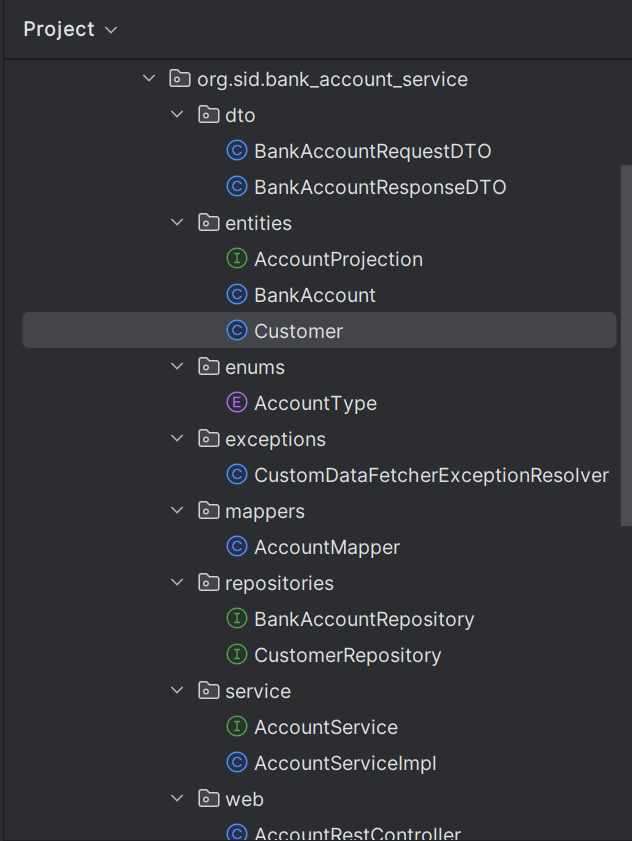
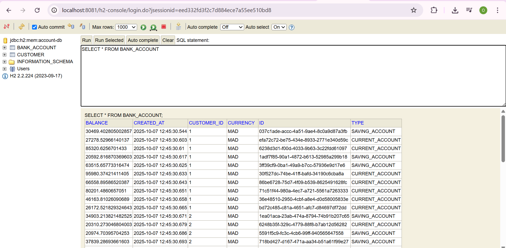
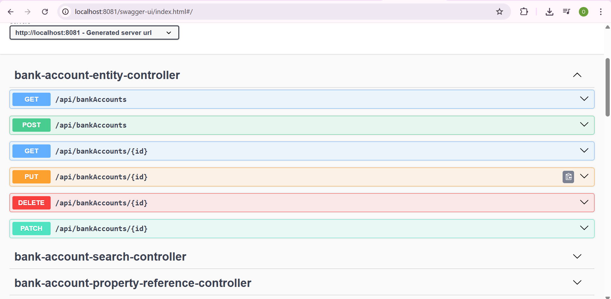
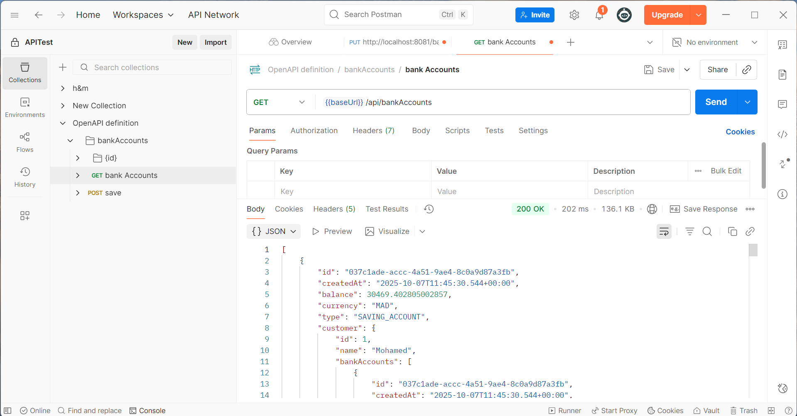
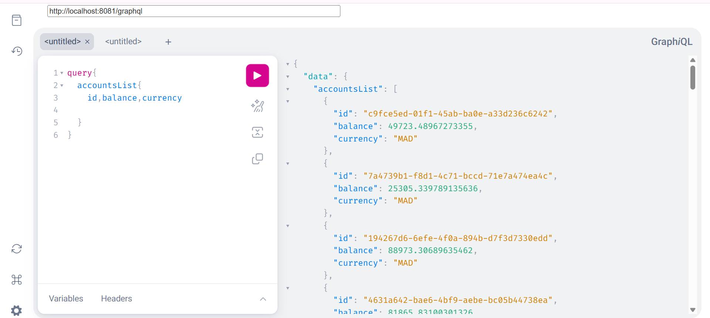
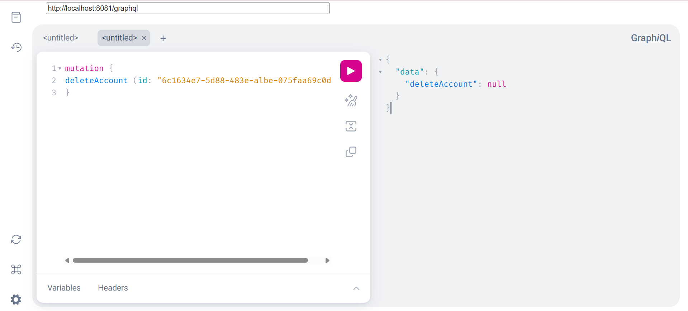

# 🏦 Bank Account Microservice

Microservice de gestion de comptes bancaires développé avec Spring Boot, exposant des APIs REST et GraphQL.

## 📋 Description du Projet

Ce projet est un microservice complet permettant la gestion de comptes bancaires avec les fonctionnalités CRUD (Create, Read, Update, Delete). Il expose plusieurs types d'APIs :
- **REST API classique** avec Spring Web
- **REST API avec Spring Data REST** (projections)
- **API GraphQL** avec Spring for GraphQL
- **Documentation Swagger/OpenAPI**

## 🛠️ Technologies Utilisées

- **Java 17+**
- **Spring Boot 3.x**
    - Spring Web
    - Spring Data JPA
    - Spring Data REST
    - Spring for GraphQL
- **Base de données** : H2 (en mémoire)
- **Documentation** : Swagger/OpenAPI
- **Outils** : Lombok, MapStruct (pour les DTOs)

## 📁 Architecture du Projet

```
src/main/java
├── entities/          # Entités JPA
├── repositories/      # Repositories Spring Data
├── services/          # Couche métier
├── web/              # Controllers REST et GraphQL
├── dto/              # Data Transfer Objects
├── mappers/          # Mappers pour conversion entités ↔ DTOs
└── enums/            # Énumérations (AccountType, etc.)

src/main/resources
├── application.properties    # Configuration
└── graphql/
    └── schema.graphqls      # Schéma GraphQL
```

## 🚀 Fonctionnalités Implémentées

### ✅ Couche DAO (Data Access Object)
- Entité JPA `BankAccount` avec :
    - `id` : Identifiant unique
    - `createdAt` : Date de création
    - `balance` : Solde du compte
    - `currency` : Devise (MAD, EUR, USD)
    - `type` : Type de compte (CURRENT_ACCOUNT, SAVINGS_ACCOUNT)
- Repository `BankAccountRepository` avec Spring Data JPA

### ✅ API REST (Spring Web)
Endpoints REST classiques :
- `GET /api/bankAccounts` : Liste tous les comptes
- `GET /api/bankAccounts/{id}` : Récupère un compte par ID
- `POST /api/bankAccounts` : Crée un nouveau compte
- `PUT /api/bankAccounts/{id}` : Met à jour un compte
- `DELETE /api/bankAccounts/{id}` : Supprime un compte

### ✅ API REST (Spring Data REST)
- Exposition automatique des repositories via `/dataApi/bankAccounts`
- Support des projections pour personnaliser les réponses

### ✅ API GraphQL
Queries :
```graphql
query {
  accountsList {
    id
    balance
    type
    currency
  }
  
  bankAccountById(id: "xxx") {
    id
    balance
  }
}
```

Mutations :
```graphql
mutation {
  addAccount(bankAccount: {
    balance: 5000.0
    type: "CURRENT_ACCOUNT"
    currency: "MAD"
  }) {
    id
    balance
  }
  
  updateAccount(id: "xxx", bankAccount: {...}) {
    id
    balance
  }
  
  deleteAccount(id: "xxx")
}
```

### ✅ DTOs et Mappers
- `BankAccountRequestDTO` : pour les requêtes entrantes
- `BankAccountResponseDTO` : pour les réponses
- Mappers pour conversion automatique

### ✅ Couche Service
- `BankAccountService` : Logique métier
- Gestion des exceptions personnalisées

### ✅ Documentation Swagger
- Interface Swagger UI accessible via `/swagger-ui.html`
- Documentation OpenAPI complète

## 📦 Installation et Démarrage

### Prérequis
- Java 17 ou supérieur
- Maven 3.6+

### Étapes

1. **Cloner le repository**
```bash
git clone https://github.com/VOTRE_USERNAME/bank-account-microservice.git
cd bank-account-microservice
```

2. **Compiler le projet**
```bash
mvn clean install
```

3. **Lancer l'application**
```bash
mvn spring-boot:run
```

L'application démarre sur `http://localhost:8081`

## 🧪 Tests et Utilisation

### 1. Console H2
- URL : `http://localhost:8081/h2-console`
- JDBC URL : `jdbc:h2:mem:bank-db`
- Username : `sa`
- Password : *(laisser vide)*

### 2. Swagger UI
- URL : `http://localhost:8081/swagger-ui.html`
- Documentation complète des APIs REST

### 3. GraphQL Playground
- URL : `http://localhost:8081/graphiql?path=/graphql`
- Ou utiliser Postman/Altair avec : `http://localhost:8081/graphql`

### 4. Exemples de requêtes

#### REST avec cURL
```bash
# Créer un compte
curl -X POST http://localhost:8081/api/bankAccounts \
  -H "Content-Type: application/json" \
  -d '{"balance":5000.0,"type":"CURRENT_ACCOUNT","currency":"MAD"}'

# Lister les comptes
curl http://localhost:8081/api/bankAccounts
```

#### GraphQL avec cURL
```bash
curl -X POST http://localhost:8081/graphql \
  -H "Content-Type: application/json" \
  -d '{"query":"{ accountsList { id balance type } }"}'
```

## 📸 Screenshots

### 1. Architecture du Projet


### 2. Console H2 - Données en Base


### 3. Swagger UI - Documentation API REST


### 4. Test Postman - API REST


### 5. GraphQL - Interface GraphiQL Query
> **Note** : Pour tester l'API GraphQL, j'ai utilisé l'extension **GraphiQL** dans le navigateur au lieu de l'interface GraphiQL intégrée qui avait des problèmes de chargement de ressources externes.


### 6. GraphQL - Interface GraphiQL Mutation



## 👨‍💻 Auteur

**OUMAS Oumaima**
